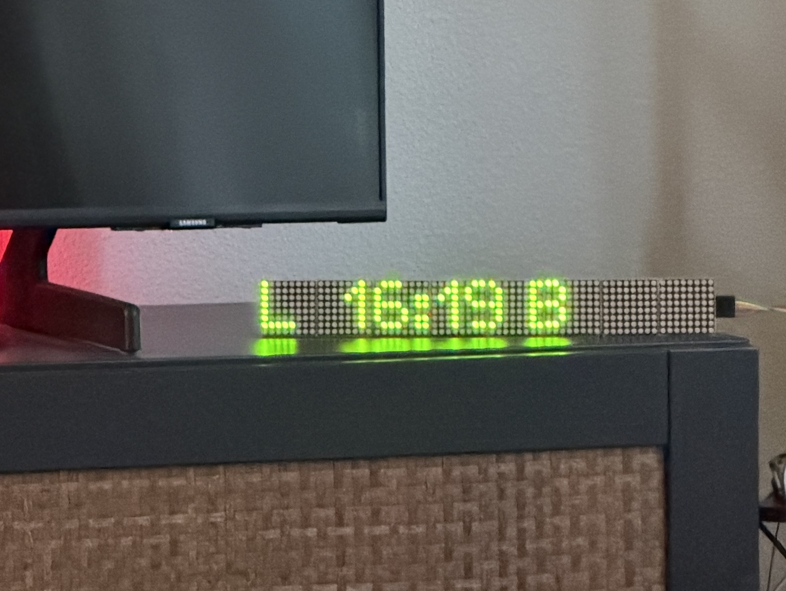
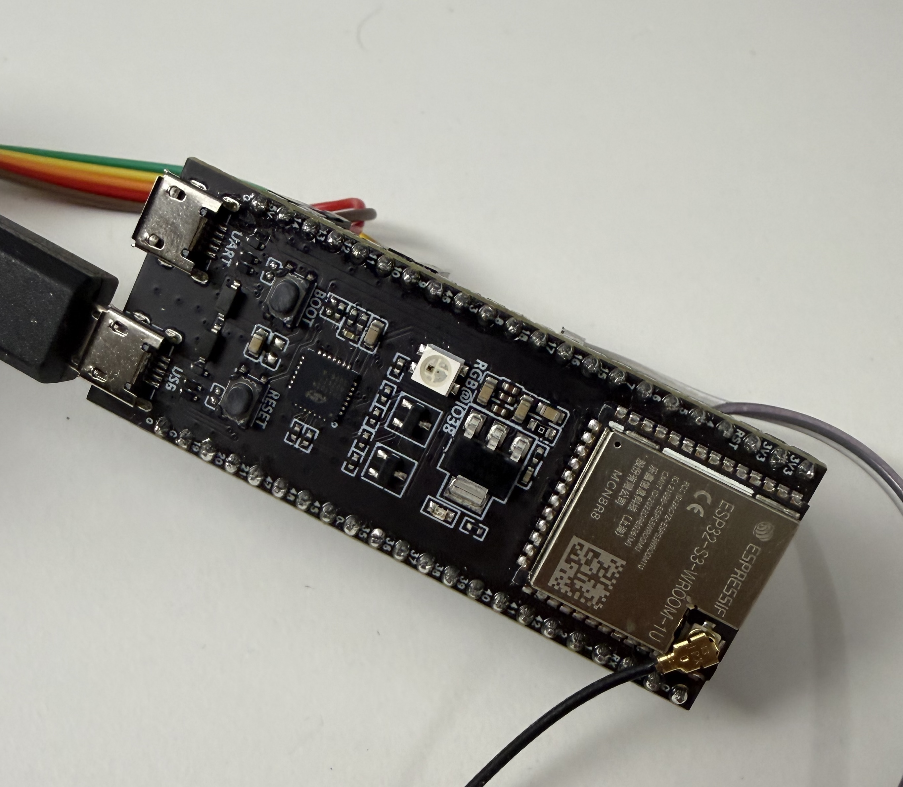
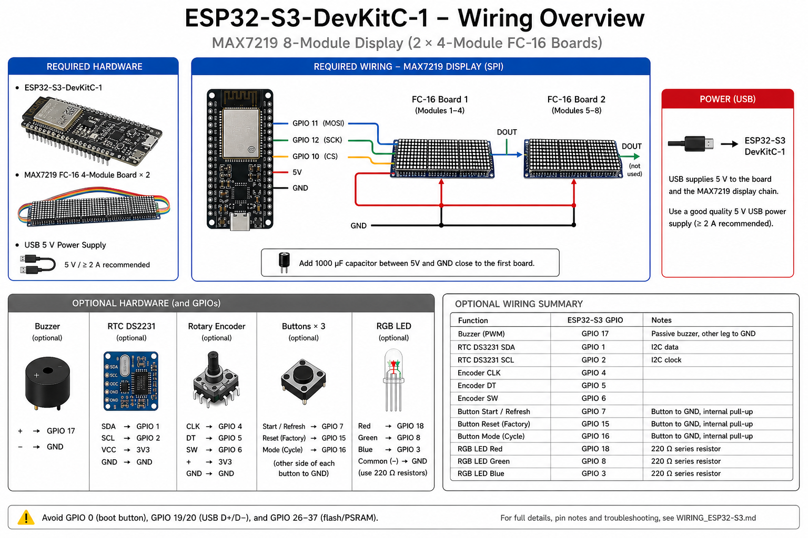

# Smart Departure Countdown

A real-time train departure countdown device built on the ESP32-S3. It connects to the [NS (Dutch Railways) API](https://apiportal.ns.nl/), calculates exactly when you need to leave home to catch your next train, and shows a live countdown on an 8-module MAX7219 LED matrix display.

Supports Walk, Bike, and Bus travel modes so the countdown automatically adjusts to your commute. A built-in web UI lets you configure the device from any browser on your local network. A REST API makes it easy to integrate with smarthome platforms (Home Assistant, Node-RED, etc.).

---

## Demo

[](https://youtube.com/shorts/pDI5CvjXEfk?feature=share)

<p>
  
  
</p>

---

## Features

- Live countdown timer ("leave in MM:SS") with automatic DST handling (Amsterdam timezone)
- Alternates between Walk and Bike countdowns every 5 seconds
- Urgent mode (<60 s to leave): animated walking/cycling icon on the rightmost display module
- Background API fetch via FreeRTOS — display never freezes or blanks during a network request
- Web UI on port 80 for all configuration, no app needed
- REST API for smarthome integration (CORS-enabled, JSON)
- All credentials stored in ESP32 NVS (flash), never in source code
- Unit test suite runnable on any desktop (`pio test -e native`)
- DS3231 RTC backup clock for time continuity during WiFi outages *(optional)*
- Buzzer audible alert when it's time to leave *(optional)*
- RGB LED status indicator *(optional)*
- Rotary encoder + buttons for on-device navigation *(optional)*

---

## Hardware

### Required

| Component | Description |
|-----------|-------------|
| **ESP32-S3-DevKitC-1** | Main microcontroller — dual-core 240 MHz, built-in WiFi, native USB |
| **MAX7219 FC-16 4×(8×8) module × 2** | Two 4-module boards chained together (64×8 dot-matrix display) |
| **USB 5 V power supply** | Powers both the ESP32 and the display chain |

### Optional

| Component | Description |
|-----------|-------------|
| **Passive Buzzer** | Audible alert when it's time to leave (disabled by default in firmware) |
| **DS3231 RTC Module** | Keeps time accurate during brief WiFi outages — device falls back to NTP-only without it |
| **Rotary Encoder** | On-device navigation input (with push button) |
| **Push Button × 3** | Start/Refresh, Mode cycle, Factory Reset |
| **RGB LED** | Visual status indicator (safe / ready / urgent / error) |

---

## Wiring

### MAX7219 Display (SPI) — required

| MAX7219 pin | ESP32-S3 GPIO |
|-------------|---------------|
| DIN (MOSI)  | GPIO 11 |
| CLK (SCK)   | GPIO 12 |
| CS / LOAD   | GPIO 10 |
| VCC         | 5 V |
| GND         | GND |

Chain the two FC-16 boards in series: DOUT of board 1 → DIN of board 2. Power from 5 V; add a 1000 µF cap on the 5 V rail close to the first board.

### Optional components

| Function | GPIO | Notes |
|----------|------|-------|
| Buzzer (PWM) | GPIO 17 | Passive buzzer, other leg to GND |
| DS3231 SDA | GPIO 1 | I2C data |
| DS3231 SCL | GPIO 2 | I2C clock |
| Rotary encoder CLK | GPIO 4 | |
| Rotary encoder DT  | GPIO 5 | |
| Rotary encoder SW  | GPIO 6 | |
| Start / Refresh button | GPIO 7 | Button to GND, internal pull-up |
| Reset button | GPIO 15 | Button to GND, internal pull-up |
| Mode button  | GPIO 16 | Button to GND, internal pull-up |
| RGB LED Red  | GPIO 18 | 220 Ω series resistor |
| RGB LED Green | GPIO 8 | 220 Ω series resistor |
| RGB LED Blue | GPIO 3 | 220 Ω series resistor |

> **Avoid** GPIO 0 (boot button), GPIO 19/20 (USB D±), and GPIO 26–37 (flash/PSRAM lines).

---

## Software Setup

### Prerequisites

- [PlatformIO](https://platformio.org/) (VS Code extension or CLI)
- Free NS API key from [apiportal.ns.nl](https://apiportal.ns.nl/) — subscribe to **Reisinformatie API**

### Build & Flash

```bash
git clone https://github.com/kamioon/departure-countdown.git
cd departure-countdown

# Build and upload
pio run -e esp32-s3-devkitc-1 --target upload

# Open serial monitor (115200 baud)
pio device monitor
```

### First-Time Configuration

On first boot the device prompts over Serial:

```
WiFi SSID: YourNetwork
WiFi Password (blank for open): ••••••••
NS API key: ••••••••••••••••••••••••••••••••
```

Credentials are saved to NVS and survive reboots. After WiFi connects, open the web UI at the IP address shown in the Serial Monitor.

You can also reconfigure everything from the web UI at any time — no reflash needed.

---

## How It Works

<p align="center">
  
</p>

```
Boot
 ├─ Load config from NVS (Preferences)
 ├─ Init display → startup animation
 ├─ Connect WiFi → sync NTP (Amsterdam TZ, DST-aware via POSIX rule)
 ├─ Start async web server on port 80
 └─ Trigger first background departure fetch

Main loop (every second)
 ├─ Try-lock API mutex (non-blocking)
 │   ├─ Got it   → read fresh departures, cache timestamps, release
 │   └─ Busy     → use cached timestamps (countdown keeps ticking live)
 ├─ Calculate "leave time" = departure − travel time − buffer
 ├─ Update LED matrix: destination | countdown | mode icon
 └─ Alternate Walk ↔ Bike view every 5 s

Background fetch task (FreeRTOS, every 2 min or on demand)
 ├─ Holds mutex for the full HTTPS round-trip
 ├─ Parses NS JSON, stores up to 10 departures
 └─ Releases mutex → main loop picks up fresh data on next tick
```

### Display Layout (8 modules, left → right)

```
 [ DH ] [ 12:34 ] [ W ]   ← normal mode: destination | countdown | mode
 [ 🚶 ] [ 00:42 ]          ← urgent (<60 s): animated icon + flashing countdown
```

Destination abbreviations currently in the code: **DH** = Den Haag, **L** = Leiden. Adjust `showCountdown()` in [display_esp32.cpp](src/display_esp32.cpp) for your route.

Mode characters: **W** = Walk, **B** = Bike, **U** = bUs.

---

## Web UI

Open `http://<device-ip>/` in any browser on your local network.

- **Live Status** — walk/bike countdowns with destination names, auto-refreshes every 2 s
- **Device panel** — chip model, CPU MHz, flash size, free heap, uptime, display connected status
- **Transport Mode** — one-click Walk / Bike / Bus selector
- **Configuration form** — station code, travel times, buffer, NS API key, WiFi credentials
- **Fetch Now** — triggers an immediate background refresh

---

## REST API

All endpoints return `application/json` with CORS headers (`Access-Control-Allow-Origin: *`) for cross-origin smarthome clients.

### `GET /api/status`

Full system snapshot.

```json
{
  "wifi": { "connected": true, "rssi": -62, "ip": "192.168.1.x", "ssid": "MyNetwork" },
  "device": {
    "chipModel": "ESP32-S3", "chipRevision": 0,
    "cpuMhz": 240, "flashKb": 8192,
    "heapFreeKb": 245, "heapTotalKb": 320,
    "uptimeSeconds": 3600
  },
  "peripherals": { "display": true },
  "fetchInProgress": false,
  "walk": { "secondsUntilLeave": 312, "direction": "Den Haag Centraal" },
  "bike": { "secondsUntilLeave": 480, "direction": "Den Haag Centraal" },
  "mode": "Walk"
}
```

### `GET /api/config`

All configuration values. Secret fields are masked as `"***"`.

```json
{
  "stationCode": "UT",
  "walkTime": 20, "bikeTime": 8, "busTime": 12, "bufferTime": 2,
  "activeMode": "Walk",
  "audioAlertsEnabled": false, "ledAlertsEnabled": true,
  "wifiSsid": "MyNetwork", "nsApiKey": "***", "wifiPassword": "***"
}
```

### `POST /api/config`

Update any subset of fields. Only send what you want to change.

```bash
curl -X POST http://<ip>/api/config \
  -H 'Content-Type: application/json' \
  -d '{"stationCode":"UT","walkTime":15,"bufferTime":3}'
# → {"ok":true}
```

Factory reset (clears NVS, reboots):

```bash
curl -X POST http://<ip>/api/config \
  -H 'Content-Type: application/json' \
  -d '{"factoryReset":true}'
```

### `POST /api/transport`

Switch transport mode instantly.

```bash
curl -X POST http://<ip>/api/transport \
  -H 'Content-Type: application/json' \
  -d '{"mode":"bike"}'
# → {"ok":true,"mode":"Bike"}
```

Valid values: `"walk"`, `"bike"`, `"bus"` (case-insensitive).

### `POST /api/fetch`

Trigger an immediate background departure refresh.

```bash
curl -X POST http://<ip>/api/fetch
# → {"ok":true,"message":"Fetch triggered"}
```

### `GET /api/departures`

Upcoming departures from the live cache.

```json
{
  "fetchInProgress": false,
  "departures": [
    { "mode": "walk", "secondsUntilLeave": 312, "direction": "Den Haag Centraal" },
    { "mode": "bike", "secondsUntilLeave": 480, "direction": "Den Haag Centraal" }
  ]
}
```

---

## Home Assistant Example

```yaml
# configuration.yaml
sensor:
  - platform: rest
    name: "Train leave walk"
    resource: http://192.168.1.x/api/status
    value_template: "{{ value_json.walk.secondsUntilLeave }}"
    unit_of_measurement: "s"
    scan_interval: 10

  - platform: rest
    name: "Train leave bike"
    resource: http://192.168.1.x/api/status
    value_template: "{{ value_json.bike.secondsUntilLeave }}"
    unit_of_measurement: "s"
    scan_interval: 10
```

---

## NS Station Codes

Look up your station code at [ns.nl/stations](https://www.ns.nl/stations) or use the NS API. Common examples:

| Code | Station |
|------|---------|
| `AMST` | Amsterdam Centraal |
| `UT` | Utrecht Centraal |
| `RTD` | Rotterdam Centraal |
| `DH` | Den Haag Centraal |
| `LW` | Leiden Centraal |
| `HRL` | Haarlem |

---

## Alert States

**RGB LED colors** (when `ledAlertsEnabled = true`):

| Color | State |
|-------|-------|
| Green | Safe — more than 10 min to leave |
| Yellow | Get ready — 5–10 min |
| Orange | Time to go — 2–5 min |
| Red (blinking) | Leave now — under 2 min |
| Blue | Train delayed |
| Purple | No departures / error |

**Audio alerts** (disabled by default — set `audioAlertsEnabled = true` via the web UI or API to enable): single beep at leave time, double beep 5 min before departure, rapid beeps in the final minute. Note: a short triple-beep plays at startup regardless of this setting.

---

## Running Unit Tests

Tests run entirely on your desktop — no hardware required.

```bash
pio test -e native

# Verbose output
pio test -e native -v

# Single file
pio test -e native -f test_countdown_calc
```

---

## Project Structure

```
departure-countdown/
├── include/
│   ├── pins.h               GPIO assignments
│   ├── config.h             Configuration manager
│   ├── time_manager.h       NTP + RTC time sync
│   ├── ns_api.h             NS API client
│   ├── countdown_calc.h     Leave-time calculator
│   ├── display.h            LED matrix driver
│   ├── alerts.h             Buzzer + LED alerts
│   ├── input.h              Button + encoder input
│   └── web_server.h         Async web server + REST API
├── src/
│   ├── main.cpp             Application entry point
│   ├── *_esp32.cpp          ESP32-specific implementations
│   ├── *_native.cpp         Desktop stub implementations (for tests)
│   └── *_stub.cpp           Minimal stubs excluded from both envs
├── test/
│   ├── test_config.cpp
│   ├── test_countdown_calc.cpp
│   ├── test_time_manager.cpp
│   └── test_ns_api.cpp
├── arduino_native/
│   └── Arduino.h            Arduino API shim for desktop test builds
├── platformio.ini
├── README.md
└── LICENSE
```

---

## Troubleshooting

**Display blank or garbage** — check SPI wiring (DIN/CLK/CS), verify 5 V supply with sufficient current (8 modules can draw up to 1 A peak), confirm `MAX_DEVICES = 8` in [pins.h](include/pins.h).

**WiFi won't connect** — ESP32 only supports 2.4 GHz. Re-enter credentials via the web UI or Serial.

**No departures** — verify the NS API key and station code in the web UI. Test the API directly: `curl -H "Ocp-Apim-Subscription-Key: YOUR_KEY" "https://gateway.apiportal.ns.nl/reisinformatie-api/api/v2/departures?station=UT&maxJourneys=5"`.

**Time is wrong** — check WiFi and NTP connectivity. The DS3231 provides a fallback but must be set at least once via NTP.

---

## Libraries Used

| Library | Purpose |
|---------|---------|
| [MD_MAX72XX](https://github.com/MajicDesigns/MD_MAX72XX) | MAX7219 hardware driver |
| [MD_Parola](https://github.com/MajicDesigns/MD_Parola) | Text and scroll effects for LED matrix |
| [ESPAsyncWebServer-esphome](https://github.com/esphome/ESPAsyncWebServer) | Non-blocking async HTTP server |
| [ArduinoJson](https://arduinojson.org/) v7 | JSON parsing and serialisation |
| [RTClib](https://github.com/adafruit/RTClib) | DS3231 RTC driver |
| [RotaryEncoder](https://github.com/mathertel/RotaryEncoder) | Rotary encoder input |

---

## License

This project is licensed under the **Creative Commons Attribution-NonCommercial 4.0 International (CC BY-NC 4.0)** license — see [LICENSE](LICENSE) for the full text.

**In short:** free to use, modify, and share for personal and educational purposes. Commercial use requires explicit written permission from the author.
